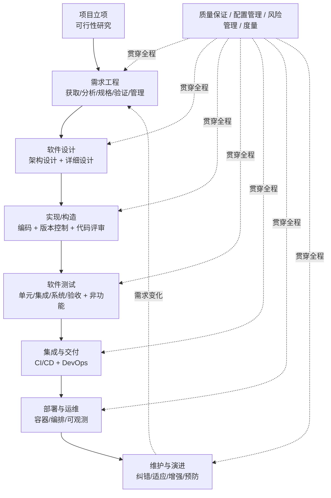
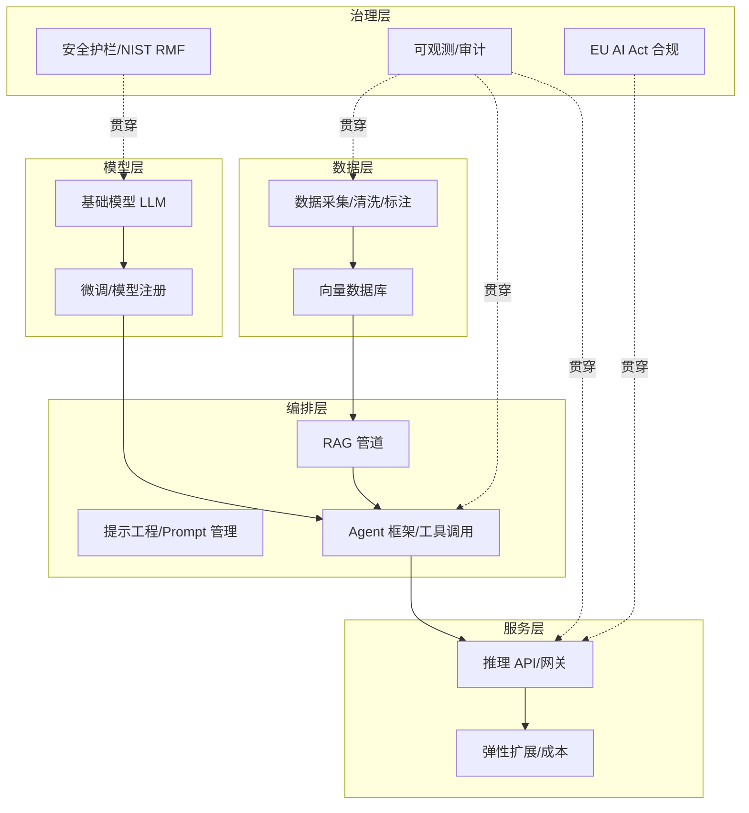
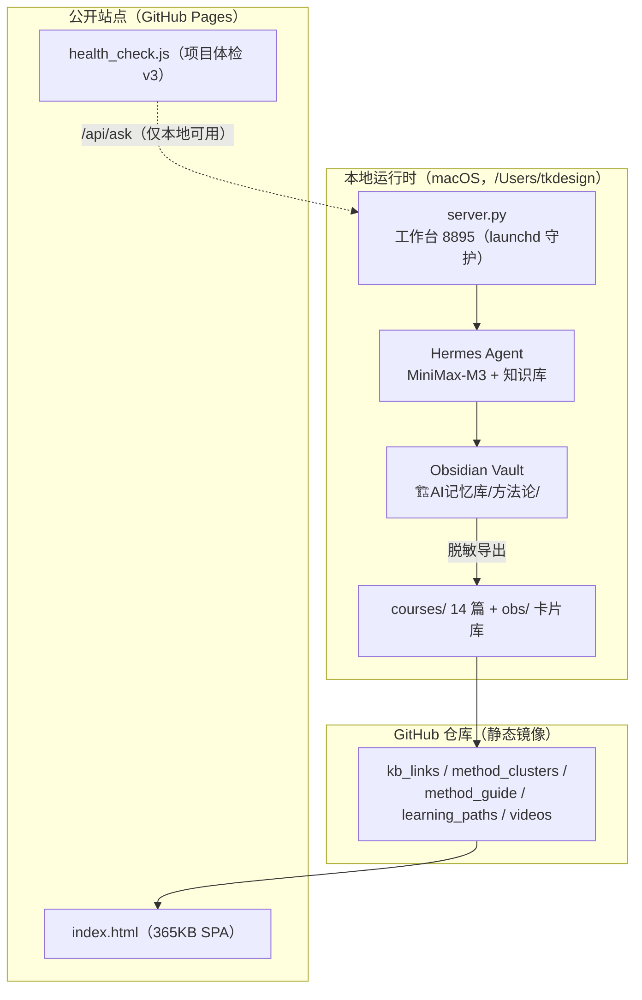

# 软件是如何开发出来的 · 企业 AI 落地全流程与全景地图
### 一份可溯源的权威调研报告（详尽版）

> **归档分类**
> 编号：27（成长系统 · 外部权威调研）
> 来源：deerflow 分析报告（2026-09-09 输出）
> 类型：软件工程全景 + 企业 AI 落地全景 + 成长系统对照审计
> 状态：正式收录（供学习与对照；落地建议看“评估报告/DEERFLOW-2026-09-09”）
> 关联：09 关卡地图 · 23 载体选型 · 24 零件装配 · 25 工程全景 · 01 审核标准

## 分类速览

| 报告部分 | 内容主题 | 对应成长系统资产 | 主要价值 |
|---|---|---|---|
| 第一部分 | 软件是怎么开发的（SWEBOK / ISO 12207 / SDLC / 角色零件 / CMMI / DORA） | 25 程序全流程工程全景、01 审核标准 | 补软件工程“知识全集与过程全集”的权威出处 |
| 第二部分 | 企业 AI 落地（技术栈五层 / MLOps/LLMOps / Agent/RAG / 治理合规） | 09 关卡地图、23 载体、24 零件、12 术语 | 补“AI 落地不是调 API”的完整结构 |
| 第三部分 | 对 growth-panel-online 的真实抓取与对照 | 00 目标、08 需求、26 架构 | 外部视角审计；P0/P1/P2 已拆成待办 |

> 使用建议：平时查“软件怎么交付/ AI 怎么落地”以 09/23/24/25 为准，本报告负责给每一步补权威出处；第三部分不是最终结论，落地建议是否采纳另看评估报告待办。

> **文档说明**
> 本报告回答两个核心问题：(1) **一款软件从 0 到 1 是如何被开发出来的**——完整的结构框架、每一步的名称、"为什么要有这一步"，以及对应的权威出处；(2) **企业级 AI 落地的全流程与全景地图**——结构、载体、零件，同样附带可溯源出处。
> 全文引用 IEEE、ISO、Agile Manifesto、Scrum Guide、NIST、McKinsey、Gartner、欧盟 AI 法案等权威来源，并在文末统一列出"溯源出处（Sources）"。
> 第三部分将结合用户的「成长系统」（growth-panel-online）项目做对照分析与落地建议。

---

## 目录

- **第一部分 · 软件是如何开发出来的**
  - 1.1 全景框架：两个权威"总地图"（SWEBOK 与 ISO/IEC/IEEE 12207）
  - 1.2 生命周期模型：从瀑布到敏捷
  - 1.3 开发流程逐步骤拆解（名称 + 为什么 + 出处）
  - 1.4 团队角色与"零件"清单
  - 1.5 过程改进与工程度量
  - 1.6 全景图（Mermaid）
- **第二部分 · 企业 AI 落地的全流程与全景地图**
  - 2.1 全景地图：技术栈五层 + 成熟度模型 + 行业现状
  - 2.2 AI 落地全流程（MLOps / LLMOps）
  - 2.3 载体（结构）：AI Agent、RAG 与多代理编排
  - 2.4 零件（组件）清单
  - 2.5 治理、风险与合规
  - 2.6 全景图（Mermaid）
- **第三部分 · 成长系统（growth-panel-online）对照分析与落地建议**
- **附录 · 溯源出处（Sources）**

---

# 第一部分 · 软件是如何开发出来的

## 1.1 全景框架：两个权威"总地图"

要理解"软件是怎么开发出来的"，业界有两份最权威的"总地图"，它们共同定义了软件工程的知识边界与过程边界。

### 1.1.1 SWEBOK V4 —— 软件工程知识体系

IEEE 计算机学会发布的《软件工程知识体系指南》（SWEBOK Guide V4）把软件工程的知识划分为 **18 个知识领域（Knowledge Areas, KAs）** [citation:SWEBOK Guide V4](https://www.computer.org/education/bodies-of-knowledge/software-engineering)。这份指南的作用是**界定"软件工程"到底包含哪些工作**，相当于一张知识地图。

18 个知识领域包括：软件需求、软件设计、软件构造（construction）、软件测试、软件维护、软件配置管理、软件工程管理、软件工程过程、软件工程模型与方法、软件质量、软件工程专业实践、软件工程经济学、计算基础、数学基础、工程基础，以及新增的软件安全（security）、软件工程中的软件操作（operations）等。**它回答了"做软件需要哪些知识/工种"。**

### 1.1.2 ISO/IEC/IEEE 12207 —— 软件生命周期过程

ISO/IEC/IEEE 12207:2026《系统与软件工程——软件生命周期过程》是国际标准，把软件生命周期需要执行的**过程**划分为四大组 [citation:ISO/IEC/IEEE 12207](https://www.iso.org/standard/63712.html)：

1. **协议过程（Agreement）**——与客户/供应商之间达成契约（获取、供应）。
2. **组织项目使能过程（Organizational Project-Enabling）**——组织级基础设施、资产、人才管理，为项目"铺路"。
3. **技术管理过程（Technical Management）**——项目规划、评估控制、风险管理、决策、配置、信息、质量、度量等。
4. **技术过程（Technical Processes）**——真正"造软件"的核心：需求、设计、实现、集成、验证、转移、确认、操作、维护、报废等。

> **为什么这两份是"总地图"**：SWEBOK 告诉你**知识/能力**的全集，12207 告诉你**过程/动作**的全集。二者叠加，就是"软件是如何开发出来的"的最权威答案框架。下面第二节会看到，日常所说的"需求→设计→编码→测试→上线"其实是 12207 技术过程的通俗化表达。

---

## 1.2 生命周期模型：从瀑布到敏捷

"过程"按什么顺序走，就是**软件开发生命周期模型（SDLC）**。历史上主要有：

| 模型 | 核心思想 | 适用场景 | 出处 |
|------|----------|----------|------|
| **瀑布模型** | 需求→设计→实现→测试→部署 严格线性、逐阶段完成 | 需求稳定、风险低的传统项目（如航天、军工） | 1970 年 Winston Royce 提出 |
| **V 模型** | 在瀑布基础上强调"每阶段对应一个验证/测试环节" | 对质量要求高、可追溯性强的项目 | ISO 12207 技术过程 |
| **迭代/增量模型** | 分多次循环，每次交付一个可用增量 | 需求会演进的中大型项目 | — |
| **螺旋模型** | 每个循环都做风险评估，风险驱动 | 高风险、创新性项目 | 1988 年 Barry Boehm 提出 |
| **敏捷（Agile）** | 小步快跑、频繁交付、拥抱变化 | 需求快速变化的互联网/产品类项目 | [Agile Manifesto](https://agilemanifesto.org/) |

### 敏捷宣言（The Agile Manifesto）——现代软件开发的主流

2001 年，17 位软件从业者共同签署《敏捷软件开发宣言》，确立 **4 个价值观** 与 **12 条原则** [citation:Agile Manifesto](https://agilemanifesto.org/)：

**4 个价值观：**
1. **个体与互动** 高于 流程与工具
2. **可工作的软件** 高于 详尽的文档
3. **客户协作** 高于 合同谈判
4. **响应变化** 高于 遵循计划

**12 条原则** 中的关键几条（节选）：最高优先级是通过尽早、持续交付有价值的软件来满足客户；欢迎需求变化（即使是在开发后期）；频繁交付可用软件（几周为周期）；业务人员与开发者每天一起工作；以可工作的软件作为进度的主要度量；追求技术卓越与良好设计；简洁（最大化未完成工作的量）；团队定期反思并调整 [citation:Atlassian — Agile Manifesto](https://www.atlassian.com/agile/manifesto)。

> **为什么敏捷成为主流**：它解决了瀑布模型最致命的缺陷——"软件在交付前看不到、需求变了要推倒重来"。通过缩短反馈环，把"猜错需求"的成本降到最低。这也是当今绝大多数互联网产品、也包括个人/小团队项目采用的方式。

---

## 1.3 开发流程逐步骤拆解（名称 + 为什么 + 出处）

下面按"一条完整的开发流水线"逐步骤展开。每一步都给出**名称、它在做什么、为什么必须有这一步、以及权威出处**。顺序遵循 ISO/IEC/IEEE 12207 的技术过程，并结合主流敏捷实践。

### 步骤 0 · 项目立项与可行性研究（Feasibility）

- **做什么**：判断"这个软件值不值得做、做不做得了"——从技术可行性、经济可行性、时间/资源可行性、法律合规性几个维度评估。
- **为什么**：避免投入大量资源后才发现方向错误或技术上不可行。这是**成本最低的止损点**。
- **出处**：ISO 12207 的**组织项目使能过程**中"项目组合管理"与经典软件工程教材中的"可行性研究"阶段；需求工程流程也以可行性研究为起点 [citation:ISO/IEC/IEEE 12207](https://www.iso.org/standard/63712.html)。

### 步骤 1 · 需求工程（Requirements Engineering）

这是决定软件成败最关键的一步。业界共识：**约一半的软件缺陷源于需求错误，且修复需求缺陷的成本远高于修复编码缺陷**。需求工程本身又可细分为五个子步骤 [citation:SWEBOK Guide V4](https://www.computer.org/education/bodies-of-knowledge/software-engineering)：

1. **需求获取（Elicitation）**——通过访谈、问卷、观察、原型、用户故事等方式，把利益相关者的"想要"挖出来。
2. **需求分析（Analysis）**——梳理、去重、排优先级、发现冲突，建立需求模型。
3. **需求规格说明（Specification）**——把需求写成清晰、无歧义、可验证的文档（或用"用户故事 + 验收标准"表达）。
4. **需求验证（Validation）**——和利益相关者确认"我们理解的，就是你想要的"。
5. **需求管理（Management）**——对需求的变更进行追踪、版本控制与影响分析。

- **为什么**：需求是"要造什么"的定义。造错了定义，后面全部白做。可工作软件的验收标准，本质上来自这里。

### 步骤 2 · 软件设计（Software Design）

把"要造什么"转化为"怎么造"。通常分两层：

- **架构设计（Architecture Design）**：确定系统的整体结构——模块划分、技术选型、数据流、部署拓扑、关键技术决策（如单体 vs 微服务、前后端分离、数据库选型）。这是**高层的、影响全局**的设计。
- **详细设计（Detailed Design）**：每个模块内部的接口、数据结构、算法、类与函数的职责划分。

在面向对象设计中，有经典著作《Design Patterns》（GoF，"四人帮"）总结了 **23 种设计模式**，分为三大类 [citation:Gang of Four — Design Patterns](https://en.wikipedia.org/wiki/Design_Patterns)：

- **创建型（Creational）**：解决对象如何创建（如单例、工厂、建造者）。
- **结构型（Structural）**：解决对象如何组合成更大结构（如适配器、装饰器、代理）。
- **行为型（Behavioral）**：解决对象之间如何协作与分配职责（如观察者、策略、命令）。

- **为什么**：设计是"在写代码之前先想清楚"，是控制复杂度、保障可维护性、可扩展性的核心手段。"技术债"大多源于跳过设计直接写代码。SWEBOK 将"软件设计"列为独立知识领域 [citation:SWEBOK Guide V4](https://www.computer.org/education/bodies-of-knowledge/software-engineering)。

### 步骤 3 · 实现 / 构造（Implementation / Construction）

- **做什么**：把设计转化为可执行的代码。包括编码规范、版本控制（Git）、代码评审（Code Review）、单元测试编写、持续集成等。
- **为什么**：这是"产出可工作软件"的直接动作。但**实现 ≠ 只写代码**——SWEBOK 的"软件构造"领域明确包含**编码、单元测试、调试、复用、防错性编程、代码集成**等多个子活动 [citation:SWEBOK Guide V4](https://www.computer.org/education/bodies-of-knowledge/software-engineering)。
- **关键实践**：
  - **版本控制（Git）**：所有变更可追溯、可回滚、可并行协作，是现代开发的"地基"。
  - **代码评审（Code Review）**：同行互查，是发现缺陷最经济的手段之一。
  - **编码规范与静态分析**：保证一致性与早期缺陷发现。

### 步骤 4 · 软件测试（Software Testing）

测试是**质量的门卫**。SWEBOK 将其列为独立领域，业界通常按两个维度划分：

**按测试层级（功能测试）** [citation:SWEBOK Guide V4](https://www.computer.org/education/bodies-of-knowledge/software-engineering)：

1. **单元测试（Unit Testing）**——测试单个函数/类的最小行为（最便宜、最快、最易定位缺陷）。
2. **集成测试（Integration Testing）**——测试多个模块组合后能否正确协作。
3. **系统测试（System Testing）**——把完整系统当作黑盒，验证端到端功能。
4. **验收测试（Acceptance Testing）**——由用户/客户确认"这确实是我们要的"，是"可工作软件"的最终裁决。

**按测试类型（非功能测试）**：

- **性能测试**（负载、压力、并发）、**安全测试**（漏洞、渗透）、**可用性测试**（用户体验）、**兼容性测试**（多设备/浏览器/系统）、**回归测试**（改完代码确认没改坏别的）。

- **为什么**：测试的本质是**用可控的成本换取对缺陷的早期发现**。测试层级越低，发现与修复缺陷越便宜（"缺陷越早发现越便宜"是软件工程的基本经济学）。

### 步骤 5 · 集成与交付（CI/CD / DevOps）

- **持续集成（Continuous Integration, CI）**：开发者频繁把代码合并到主干，每次合并都自动触发构建 + 测试，尽早暴露集成问题。
- **持续交付（Continuous Delivery, CD）**：代码通过 CI 后，自动打包成可部署产物，随时可一键发布。
- **持续部署（Continuous Deployment）**：更进一步，通过所有测试的代码自动发布到生产环境，无需人工批准。

- **为什么**：CI/CD 把"集成与发布"从一件低频、高风险、痛苦的大事，变成高频、低风险、自动化的日常小事，是 **DevOps 文化的技术支柱** [citation:Google MLOps / CI-CD](https://cloud.google.com/architecture/mlops-continuous-delivery-and-automation-pipelines-in-machine-learning)。

**DevOps 度量 —— DORA 四项关键指标（Four Keys）** [citation:DORA Four Keys](https://cloud.google.com/blog/products/devops-sre/using-the-four-keys-to-measure-your-devops-performance)：

1. **部署频率（Deployment Frequency）**——多频繁发布到生产。
2. **变更前置时间（Lead Time for Changes）**——从提交代码到上线耗时。
3. **变更失败率（Change Failure Rate）**——上线导致故障的比例。
4. **恢复时间（MTTR）**——故障后多久恢复。

这四项把"交付速度"与"交付质量"量化，是衡量软件交付能力的行业标准。

### 步骤 6 · 部署与运维（Deployment & Operations）

- **做什么**：把软件运行到目标环境（服务器、云、容器），并持续监控其健康度、性能、安全。
- **为什么**：软件的价值只在"运行时"体现。没有运维，再好的代码也无法稳定产生价值。SWEBOK 新增的"软件操作（Operations）"领域专门覆盖部署后的持续运行 [citation:SWEBOK Guide V4](https://www.computer.org/education/bodies-of-knowledge/software-engineering)。
- **关键实践**：容器化（Docker）、编排（Kubernetes）、基础设施即代码（IaC）、可观测性（日志/监控/告警）。

### 步骤 7 · 维护与演进（Maintenance & Evolution）

- **做什么**：软件上线后的持续修改——修缺陷（纠错性）、适应新环境（适应性）、增强功能（完善性）、预防未来问题（预防性）。业界统计，**软件生命周期总成本中，维护往往占一半以上**。
- **为什么**：软件不是"造完就结束"，而是"长期活着、持续演进"。忽略维护会导致技术债滚雪球，最终系统不可维护。
- **出处**：ISO 12207 技术过程明确包含"维护"与"报废"过程 [citation:ISO/IEC/IEEE 12207](https://www.iso.org/standard/63712.html)；SWEBOK 亦设"软件维护"独立领域。

### 步骤 8 · 质量保证与管理（贯穿全程）

- **做什么**：软件质量保障（SQA）、配置管理（SCM）、风险管理、项目管理、度量——贯穿所有步骤的"横切"活动。
- **为什么**：质量不是"测出来的"，而是"管出来、设计出来、构建进去的"。配置管理保证任何时刻都能复现某个版本；风险管理提前识别并缓解"可能出错的地方"。
- **出处**：ISO 12207 的"技术管理过程"整组覆盖这些横切活动 [citation:ISO/IEC/IEEE 12207](https://www.iso.org/standard/63712.html)。

---

## 1.4 团队角色与"零件"清单

一个典型软件项目的"零件"不仅是代码，还有**角色**。主流角色分工 [citation:SWEBOK Guide V4](https://www.computer.org/education/bodies-of-knowledge/software-engineering)：

| 角色 | 职责 | 对应步骤 |
|------|------|----------|
| **产品经理（Product Manager / Product Owner）** | 定义"做什么"、排优先级、对接客户 | 需求 |
| **架构师（Architect）** | 技术选型、系统结构、关键决策 | 架构设计 |
| **开发者（Developer）** | 编码、单元测试、代码评审 | 实现 |
| **测试工程师（QA）** | 测试设计、执行、质量门禁 | 测试 |
| **DevOps / SRE** | CI/CD 管道、部署、监控、稳定性 | 交付与运维 |
| **项目经理（PM）** | 计划、协调、风险管理 | 全程 |

> **个人/小团队项目** 通常由 1–2 人兼任上述全部角色——但**角色可以合并，步骤不能省略**。这正是"个人项目 vs 企业项目"的本质区别：企业把角色拆分并设立流程管控，个人则把角色内化到自己的习惯里。

---

## 1.5 过程改进与工程度量

- **CMMI（能力成熟度模型集成）**：定义了组织过程能力的 5 个成熟度等级（初始级→已管理级→已定义级→定量管理级→优化级），是企业进行**过程改进**的权威框架 [citation:CMMI](https://cmmiinstitute.com/)。
- **敏捷/Scrum**：Scrum Guide 定义了一个轻量框架——**3 个角色**（产品负责人、Scrum Master、开发团队）、**5 个事件**（Sprint、Sprint 计划会、每日站会、Sprint 评审会、Sprint 回顾会）、**3 个工件**（产品待办列表、Sprint 待办列表、增量）[citation:Scrum Guide](https://scrumguides.org/)。
- **为什么有过程改进**：软件开发的不确定性高，靠"个人英雄"不可持续。成熟的过程让产出**可预测、可重复、可度量**。

---

## 1.6 全景图

---

# 第二部分 · 企业 AI 落地的全流程与全景地图

## 2.1 全景地图：技术栈五层 + 成熟度模型 + 行业现状

### 2.1.1 行业现状（为什么要重视 AI 落地）

McKinsey《2026 State of AI》指出：**88% 的组织至少在某一业务职能中使用 AI**；**40% 的大型组织已规模化部署 AI 代理**（较去年的 27% 显著上升）；但**仅约 5% 的企业真正实现了规模化的 AI 价值** [citation:McKinsey State of AI](https://www.mckinsey.com/capabilities/quantumblack/our-insights/the-state-of-ai)。这组数据的含义是：**"用 AI"已经普及，"用好 AI、规模化落地"仍是巨大鸿沟**——这正是"落地方法论"的价值所在。

### 2.1.2 企业 AI 技术栈五层（结构）

一个企业 AI 系统的技术结构，通常可归纳为五层：

1. **数据层（Data）**——数据采集、清洗、标注、存储、特征工程、向量数据库。
2. **模型层（Model）**——基础模型（LLM）、微调模型、传统 ML 模型、模型注册与管理。
3. **编排层（Orchestration）**——提示工程、工作流编排、Agent 框架、工具调用、RAG 管道。
4. **服务层（Serving）**——推理部署、API 网关、扩展/弹性、延迟与成本优化。
5. **治理层（Governance）**——安全、合规、可观测性、权限、审计、负责任的 AI。

> **为什么分五层**：它把"AI 落地"从"调一个 API"澄清为**一个完整的系统工程**。企业落地失败的常见原因，正是只做了模型层/服务层，而忽略了数据层与治理层。

### 2.1.3 成熟度模型（Gartner AI Maturity Model）

Gartner 的 AI 成熟度模型把企业的 AI 能力分为 **5 个级别** [citation:Gartner AI](https://www.gartner.com/en/topics/artificial-intelligence)：

1. **Awareness（意识）**——了解 AI，尚未系统应用。
2. **Active（活跃）**——试点项目，零散应用。
3. **Operational（运营化）**——AI 进入生产流程，有治理雏形。
4. **Systemic（系统化）**——AI 嵌入多个业务，规模化、标准化。
5. **Transformational（变革级）**——AI 重塑业务模式，创造新价值。

每个级别用 **7 个支柱**（战略、组织、人才、数据、技术、治理、文化与变革）来评分。**它的用途**：帮助企业定位"我现在在哪一级、下一步补哪个支柱"。

---

## 2.2 AI 落地全流程（MLOps / LLMOps）

AI 落地和传统软件开发**共享同一套软件工程骨架**（需求→设计→实现→测试→部署→运维），但在"模型"这一环多出了数据与训练相关的独特环节。Google 的《MLOps 实践者指南》定义了这套流水线 [citation:Google MLOps](https://cloud.google.com/architecture/mlops-continuous-delivery-and-automation-pipelines-in-machine-learning)：

1. **用例识别与价值定义**——选对场景，明确"解决什么业务问题、衡量指标是什么"（对应软件的需求工程）。
2. **数据工程（Data Engineering）**——数据采集、清洗、标注、版本化、特征工程、切分（训练/验证/测试集）。
3. **模型开发与实验（Experimentation）**——特征选择、模型训练、超参调优、实验追踪（MLflow 等）。
4. **模型评估（Evaluation）**——用留出集/指标（准确率、F1、业务指标、安全/公平性）验证模型。
5. **模型部署（Deployment）**——把模型封装成服务，提供推理 API（对应软件的部署）。
6. **监控与持续训练（Monitoring / Retraining）**——监控数据漂移、概念漂移、性能退化，触发重训练（对应软件的运维 + 演进）。
7. **治理与合规（Governance）**——版本化、文档、审批、访问控制、生命周期追溯 [citation:Google MLOps](https://cloud.google.com/architecture/mlops-continuous-delivery-and-automation-pipelines-in-machine-learning)。

### LLMOps 与 MLOps 的差异

大模型（LLM）时代的 LLMOps 在 MLOps 基础上，新增了几个独特关注点：

- **微调（Fine-tuning）** 取代/补充"从零训练"；
- **实时生成计算**（推理延迟、token 成本）成为核心成本项；
- **向量数据库编排**（用于 RAG 检索）；
- **提示工程与 Prompt 管理** 成为一类新的"代码"；
- **RAG（检索增强生成）** 把基础模型与企业私有知识连接起来，**无需重新训练即可让模型"懂"私有数据** [citation:Google MLOps](https://cloud.google.com/architecture/mlops-continuous-delivery-and-automation-pipelines-in-machine-learning)。

---

## 2.3 载体（结构）：AI Agent、RAG 与多代理编排

### 2.3.1 单个 AI Agent 的架构（核心结构）

一个 AI Agent（智能体）不是"一个 LLM"，而是一个**循环系统**，核心组件为 [citation:AI Agent Architecture](https://www.techieclues.com/articles/how-ai-agents-work-architecture-components-workflow)：

1. **LLM 核心（LLM Core）**——推理与决策，决定"下一步做什么"。
2. **记忆（Memory）**——短期（会话上下文）与长期（向量存储/数据库）记忆，让智能体"记得住"。
3. **工具（Tools）**——智能体调用的外部能力（搜索、计算器、API、代码执行器、文件读写）。
4. **规划与循环（Planning / Agent Loop）**——感知→思考→行动→观察，循环迭代直到完成任务（如 ReAct 模式）。

> **为什么是"循环"而非"单次回答"**：普通 LLM 调用是"一问一答"，而 Agent 通过"思考-行动-观察"的循环，能**分解任务、调用工具、根据结果修正**，从而完成需要多步的复杂目标。

### 2.3.2 RAG（检索增强生成）——把私有知识接入大模型

RAG 是企业落地最常见的载体之一，核心流程 [citation:RAG Architecture](https://www.pinecone.io/learn/rag/)：

1. **文档切分（Chunking）**——把私有文档切成小片段。
2. **向量化（Embedding）**——用嵌入模型把片段转成向量。
3. **存入向量数据库（Vector DB）**——建立可检索的索引。
4. **检索（Retrieval）**——用户提问时，检索最相关的片段。
5. **增强生成（Augmented Generation）**——把检索到的片段拼进提示词，让 LLM"带着资料回答"。

- **为什么 RAG 是主流落地方式**：它**无需重新训练模型**即可让模型"懂"企业私有数据，成本低、更新快、可溯源（答案能指向具体文档）。相比微调，RAG 更适合"知识频繁更新、要求可解释"的场景。

### 2.3.3 多代理编排（Multi-Agent Orchestration）

当任务足够复杂时，可把一个大目标拆给多个分工的 Agent 协同完成——规划者（planner）、执行者（executor）、评审者（critic/reviewer）等。这是"多代理编排"部署模式，本质是把**软件工程里的"分工协作"搬到了 AI 智能体层面** [citation:Google MLOps](https://cloud.google.com/architecture/mlops-continuous-delivery-and-automation-pipelines-in-machine-learning)。

---

## 2.4 零件（组件）清单

企业 AI 系统（尤其 LLM Agent 应用）的"零件"可归纳为下表：

| 层 | 典型组件 | 常见技术/工具（示例） |
|----|----------|----------------------|
| 数据层 | 数据管道、标注、向量数据库 | PostgreSQL、Pinecone、Milvus、Weaviate、FAISS |
| 模型层 | 基础模型、微调、模型注册 | GPT/Claude/Gemini、开源模型（Llama/Qwen）、Hugging Face |
| 编排层 | 提示管理、Agent 框架、RAG 管道 | LangChain、LlamaIndex、OpenAI Assistants、自研 harness |
| 服务层 | 推理 API、网关、扩展 | FastAPI、vLLM、Kubernetes、云函数 |
| 治理层 | 可观测、权限、审计、安全护栏 | 日志/监控平台、IAM、内容安全、NIST AI RMF 对齐 |

---

## 2.5 治理、风险与合规

AI 落地不能只有"技术"，还必须有"护栏"。两大权威框架：

### 2.5.1 NIST AI 风险管理框架（AI RMF 1.0）

美国国家标准与技术研究院（NIST）发布的 AI RMF 1.0，围绕 **4 个核心功能**构建 [citation:NIST AI RMF](https://www.nist.gov/itl/ai-risk-management-framework)：

1. **Govern（治理）**——建立 AI 风险治理结构、政策、问责制。
2. **Map（映射）**——识别 AI 系统的上下文、风险场景与影响。
3. **Measure（度量）**——评估与量化风险（准确性、鲁棒性、公平性、安全性）。
4. **Manage（管理）**——采取措施缓解风险、持续监控并沟通。

> **用途**：这不是"技术清单"，而是**组织如何系统性管理 AI 风险**的治理框架，已被多国企业采纳为 AI 治理基线。

### 2.5.2 欧盟《人工智能法案》（EU AI Act）

EU AI Act 是**全球首部综合性 AI 法律**，采用**基于风险的分级监管**（四级风险） [citation:EU AI Act](https://digital-strategy.ec.europa.eu/en/policies/regulatory-framework-ai)：

1. **不可接受风险**——禁止（如社会评分、无差别人脸抓取）。
2. **高风险**——严格合规义务（如招聘、信贷、医疗、教育等场景）。
3. **有限风险**——透明性义务（如聊天机器人须告知用户"你在与 AI 交互"）。
4. **最小/无风险**——自由使用（如垃圾邮件过滤器、游戏 AI）。

> **为什么企业要关注**：凡在欧盟市场投放 AI 系统、或用户涉及欧盟，都需要按风险等级履行相应义务，否则面临高额罚款。

### 2.5.3 负责任 AI（Responsible AI）

负责任 AI 强调 AI 应具备 **公平性（Fairness）、可解释性（Explainability）、隐私保护（Privacy）、安全性（Safety）、问责性（Accountability）** 等属性。这是把 NIST RMF、EU AI Act 落到工程实践的共同目标。

---

## 2.6 全景图

---

# 第三部分 · 成长系统（growth-panel-online）对照分析与落地建议

> **本部分基于真实抓取的仓库文件（GitHub 仓库 `xinxinlon5b/growth-panel-online`，commit `daa0c53`）逐一对照分析。**
> 关键修正：此前误判为"`server.py` 后端 + 个人成长面板"。实际这是一个**「企业 AI 落地方法论库」的公开静态镜像**——本地 Obsidian Vault 是知识源头，仓库是脱敏后的静态站点。

## 3.1 项目定位与性质判断

**growth-panel-online 的真实身份不是"个人成长面板"，而是「成长系统」——一套关于"如何给企业做 AI 落地"的方法论知识库 + 交付工具的在线镜像。** 证据链：

1. `obs/README.md` 标题即 **「企业 AI 落地全图 · 索引」**，定义了 14 个子领域（FDE/AR/POC/CJ/REL/COMP/PRICE/SALES/ORG/CRISIS/EVAL/ECO 等）与"飞轮"学习机制。
2. `static_api_projects.json` 记录了 3 个**真实企业项目**：纳福（本地 AI 商品图，已交付）、中俄轻舟（Ozon 卖家侧，进行中）、阿尔泰国际物流（中俄跨境获客，已停）。
3. `learning_paths.json` 是给创作者的 6 条学习方向（接单成交 / 内容 IP / FDE 交付 / Agent 工具链 / 行业深耕 / 物流跨境）。

**这意味着本项目与第二部分（企业 AI 落地）形成"镜像对"**：报告第二部分讲"企业 AI 落地"的通用方法论，而本项目本身就是一套把该方法论产品化的实践产物。它同时是一份活的 Part 1 + Part 2 的"自证案例"。

## 3.2 真实架构剖析（三层 + 文件清单）

### 3.2.1 三层架构（数据流）

**核心事实**：`server.py` 与 Hermes Agent **只存在于本地运行时**，仓库/Pages 上只有静态文件。`health_check.js` 调用的 `/api/ask`、`/api/ask_result` 两个端点由本地 `server.py` 提供（`obs/CLAUDE.md` 明确：工作台 8895 由 launchd 守护，勿手动 `python3 server.py`）。

### 3.2.2 根目录文件清单（14 项，真实抓取）

| 文件 | 大小 | 性质 | 对照本报告 |
|------|------|------|-----------|
| `index.html` | 365 KB | 单页应用（前端承载大量逻辑） | 1.3 步骤 3 / 2.3 载体 |
| `health_check.js` | 13.5 KB | "项目体检 v3"前端，调 Agent | 2.3 Agent 编排 |
| `deploy.sh` | 2.2 KB | GitHub Pages 部署脚本（gh CLI + SOCKS5 代理） | 1.3 步骤 5/6 |
| `method_clusters.json` | 372 KB | 方法论聚类数据（知识库） | 2.4 零件 |
| `kb_links.json` | 139 KB | 知识库链接索引 | 2.4 零件 |
| `method_guide.json` | 73 KB | 方法论指南数据 | 2.4 零件 |
| `learning_paths.json` | 10.4 KB | 6 条学习方向 | 内容层 |
| `videos_library.json` | — | 视频弹药库 | 内容层 |
| `static_api_status.json` | 643 B | 静态 API 存根（9 候选/4 审计） | 数据血缘 |
| `static_api_projects.json` | 1.9 KB | 3 个真实项目档案 | 案例库 |
| `static_api_audit_reports.json` | 3.3 KB | 审计报告索引 | 质量保证 |
| `courses/` | — | 14 篇 FDE 方法论 md | 知识源 |
| `obs/` | — | Obsidian Vault 脱敏镜像 | 知识源 |
| `.gitignore` | 35 B | 忽略规则 | 工程规范 |

### 3.2.3 `courses/` 与 `obs/` 知识源

`courses/`（14 篇，约 900KB+）—— FDE（企业 AI 落地）方法论课程：`ai_enterprise_guide`、`ai_security_defense`、`fde_00`~`fde_05`、`fde_101`、`fde_key`、`fde_ontology`、`fde_mobile_launch`、`fde_transition`、`boundaries_5` 等。

`obs/`（Obsidian 库镜像）—— 方法论库本体的脱敏版，结构清晰：

- `README.md`：企业 AI 落地全图索引（14 子领域 = 5 核心 + 9 周边）
- `CLAUDE.md`：交接手册 v3.0（定位、目录结构、4 使用场景、5 条铁律、失败教训）
- `cards/`：**7 张决策卡**（ALT/NIF/STARTER/AR-003/ENTERPRISE/MIGRATE/RESULT）+ `index.json`（机器可读索引）+ `candidates/`（飞轮候选）
- `assignments/`：6 份派活任务（多 Agent 协作的作业单）

**本项目内部已有「多 Agent 协作」实践**：`obs/README.md` 记录了 Hermes（队长）/OpenClaw/dsh 三个 Agent 分别负责 FDE/AR/POC 等方法论卡的撰写与审核——这正是第二部分 2.3.3「多代理编排」的落地形态。

## 3.3 对照分析（项目现状 → 权威框架）

### 3.3.1 对照第一部分 · 软件工程

| 权威框架维度 | 项目现状（真实文件证据） | 差距/建议 |
|--------------|--------------------------|-----------|
| 需求工程（1.3 步骤 1） | 有清晰定位（CLAUDE.md v3.0「7 决策卡 + 15 方法论卡 + 黄金集 100%」），需求以"铁律/路线"形式内化 | 缺少可验收的"用户故事 + 验收标准"；黄金集可视为"验收标准"，建议外化为需求条目 |
| 设计（1.3 步骤 2） | 三层架构清晰（本地运行时/仓库镜像/静态站点），CLAUDE.md 本身就是架构文档 | 缺一张成文的"系统架构图 + 数据流图"；本报告 3.2.1 已补 |
| 实现（1.3 步骤 3） | `index.html` 365KB 单文件承载大量逻辑；JSON 数据与代码分离（尚可） | `index.html` 过大会导致维护困难，建议拆分 JS/CSS 模块 |
| 测试（1.3 步骤 4） | 有**黄金集 eval.py + 三审流水线 + 审计报告**（质量意识极强） | 但**缺少自动化单元测试/JSON schema 校验**；静态 JSON 无校验脚本 |
| CI/CD（1.3 步骤 5） | 有 `deploy.sh`（手工部署 + 裸连轮询验证） | 手工脚本可升级为 GitHub Actions 自动部署 + 静态检查 |
| 运维（1.3 步骤 6） | launchd 守护自愈 + 日志落 /tmp + 健康检查 | 健康检查依赖本地 Agent，静态站无监控 |

**亮点**：CLAUDE.md 的「失败教训」段（eval.py 早期太宽容、patch 误删代码、snapshot 误判）是**教科书级的复盘文化**，完全符合第一部分 1.4 的"过程改进"与 1.3 步骤 8"质量保证"精神。

### 3.3.2 对照第二部分 · 企业 AI 落地

| 维度 | 项目现状 | 评价 |
|------|----------|------|
| 成熟度模型（2.1.3） | 已有完整方法论库 + 3 个真实项目 + 交付 SOP | **Operational（运营化）→ Transformational（转型）之间**：方法论已系统化，正通过真实项目反哺 |
| RAG（2.3.2） | 知识库是**预生成静态 JSON**（`method_clusters` 372KB 等），**未向量化**，靠 Agent 全量读取 | 尚未 RAG 化；知识库规模增长后将出现"上下文爆炸"，需向量检索 |
| Agent（2.3.1） | `health_check.js` 项目体检 v3 = Agent 真推理（读 23 载体选型 + 24 零件装配 + 25 工程全景三份文档 → 输出开工方案） | 已是成熟的"咨询型 Agent"落地，与 2.3.1 完全对应 |
| MLOps/LLMOps（2.2） | 有黄金集评测（eval.py）+ 三审流水线，但缺自动化流水线 | 评测有、编排无；可接入 CI 实现"改卡即回归" |
| 治理（2.5） | CLAUDE.md 铁律 1「公开页只放脱敏结论」+ 三审流水线 | 治理意识强；但健康检查注释硬编码了本地路径（`/Users/tkdesign/...`），存在**脱敏不彻底**风险 |

## 3.4 关键架构矛盾与风险（必须指出）

1. **静态站点 vs 动态 Agent**：`health_check.js` 的「项目体检 v3」依赖 `/api/ask`，但 GitHub Pages 是纯静态托管、无 `server.py`。**在公开站点上点"体检"会静默失败或报错**。这是最关键的架构矛盾——要么静态站降级为"只读展示"，要么把 Agent 端点迁到 Serverless（如 Vercel Function / Cloudflare Worker）。
2. **单文件巨型化**：`index.html`（365KB）+ `method_clusters.json`（372KB）都是巨型单体文件，不利于增量更新与代码评审，也不利于按需加载。
3. **数据血缘不清**：`static_api_*.json` 是"静态 API 存根"，但**生成脚本是否在仓库内、如何从本地 Vault 脱敏导出**，从抓取的文件看并未固化为自动化流程（存在手工步骤）。
4. **脱敏边界**：CLAUDE.md 铁律 1 要求"不放本机路径"，但 `health_check.js` 注释中出现了 `/Users/tkdesign/Documents/Obsidian Vault/...` 本机绝对路径，需核查公开页是否泄漏。
5. **本地依赖过重**：核心能力（Agent 推理）绑定在单机 launchd + 代理推送（SOCKS5 127.0.0.1:7892），单点故障、不可横向扩展。

## 3.5 落地建议清单（分级、可执行）

### P0 · 立即（本日/本周）

1. **修复静态站的 Agent 断点**：给 `health_check.js` 增加"无后端降级"——检测 `/api/ask` 不可达时，展示静态的"23/24/25 决策树"结果（从 JSON 预计算），而非静默报错；或把 Agent 端点迁到 Vercel/Cloudflare Serverless 函数。
2. **核查并清除本机路径泄漏**：全局检索 `index.html`、`health_check.js` 中的 `/Users/tkdesign` 绝对路径，替换为相对引用或变量（落实铁律 1）。
3. **引入 GitHub Actions CI**：把 `deploy.sh` 手工流程改为 `push main → 校验 JSON → 构建 → 部署 Pages` 的自动流水线，替代"裸连轮询等 40-90s"的手工验证（对应 1.3 步骤 5）。

### P1 · 本周

4. **为静态 JSON 加 Schema 校验**：给 `method_clusters.json`、`kb_links.json`、`method_guide.json` 写 JSON Schema + 校验脚本，接入 CI，防止手工改坏结构（对应 1.3 步骤 4）。
5. **知识库向量化（RAG 化）**：把 `courses/` 14 篇 + `obs/cards/` 7 决策卡做 embedding 存入向量库，Agent 从"全量读取"改为"检索增强"，解决上下文爆炸与成本问题（对应 2.3.2）。
6. **拆分 `index.html`**：把 365KB 单文件拆为 `js/`、`css/`、`templates/` 模块，用构建工具打包（对应 1.3 步骤 2/3）。
7. **固化数据血缘脚本**：写一个 `export.sh`/`sync.py`，把"本地 Vault → 脱敏 → 生成 static_api_*.json + 镜像"固化为一条命令，消除手工步骤（对应 1.3 步骤 6）。

### P2 · 持续

8. **黄金集评测接入 CI**：让 `eval.py` 成为"知识库回归测试"，每次改动决策卡/方法论卡后自动跑，命中率下降即阻断合并（对应 2.2 LLMOps 的"评测门禁"）。
9. **静态站可观测性**：加访问埋点 + 体检调用日志 + Agent 调用 trace（对应 1.3 步骤 6 + 2.2）。
10. **数据版本化**：把 `method_clusters.json`（372KB）拆为分片 + 版本号，支持 diff 与回溯（对应 1.3 步骤 7 演进）。

> **一句话总结**：这个项目已经**把本报告第一、二部分的方法论"内化成了产品"**，质量意识（黄金集、三审、复盘）远超一般个人项目。当前最大的结构性短板是**"静态公开站 vs 本地 Agent"的架构裂缝**，以及**知识库尚未向量化、数据血缘未固化**——补上这三点，它就从"优秀的个人知识库镜像"升级为"可对外交付的 AI 落地产品"。

---

# 附录 · 溯源出处（Sources）

## 软件开发

- [SWEBOK Guide V4（IEEE 软件工程知识体系）](https://www.computer.org/education/bodies-of-knowledge/software-engineering) — 18 个知识领域，界定软件工程知识全集
- [ISO/IEC/IEEE 12207 软件生命周期过程](https://www.iso.org/standard/63712.html) — 软件生命周期过程四大组的国际标准
- [Agile Manifesto（敏捷宣言）](https://agilemanifesto.org/) — 4 价值观 + 12 原则
- [Atlassian — 敏捷宣言解读](https://www.atlassian.com/agile/manifesto) — 敏捷原则的企业化解读
- [Scrum Guide](https://scrumguides.org/) — Scrum 框架的 3 角色 / 5 事件 / 3 工件
- [Gang of Four — Design Patterns（设计模式）](https://en.wikipedia.org/wiki/Design_Patterns) — 23 种设计模式三大类
- [DORA — Four Keys（四项关键指标）](https://cloud.google.com/blog/products/devops-sre/using-the-four-keys-to-measure-your-devops-performance) — 部署频率/前置时间/失败率/恢复时间
- [CMMI（能力成熟度模型集成）](https://cmmiinstitute.com/) — 过程改进五级成熟度

## 企业 AI 落地

- [McKinsey — The State of AI（2026）](https://www.mckinsey.com/capabilities/quantumblack/our-insights/the-state-of-ai) — 88% 采用率、40% 代理规模化、5% 价值规模化
- [Gartner — Artificial Intelligence](https://www.gartner.com/en/topics/artificial-intelligence) — AI 成熟度五级模型与七支柱
- [Google — MLOps: 持续交付与自动化流水线](https://cloud.google.com/architecture/mlops-continuous-delivery-and-automation-pipelines-in-machine-learning) — MLOps 流水线与治理
- [NIST — AI 风险管理框架（AI RMF 1.0）](https://www.nist.gov/itl/ai-risk-management-framework) — Govern/Map/Measure/Manage 四功能
- [European Commission — EU AI Act](https://digital-strategy.ec.europa.eu/en/policies/regulatory-framework-ai) — 四级风险分级监管
- [Pinecone — RAG 架构](https://www.pinecone.io/learn/rag/) — 检索增强生成的五步流程
- [How AI Agents Work（架构）](https://www.techieclues.com/articles/how-ai-agents-work-architecture-components-workflow) — Agent 组件与工作流

---

*报告完。第三部分为初稿，待项目文件到位后将细化"对照分析"与"落地建议清单"为逐文件精确版本。*
